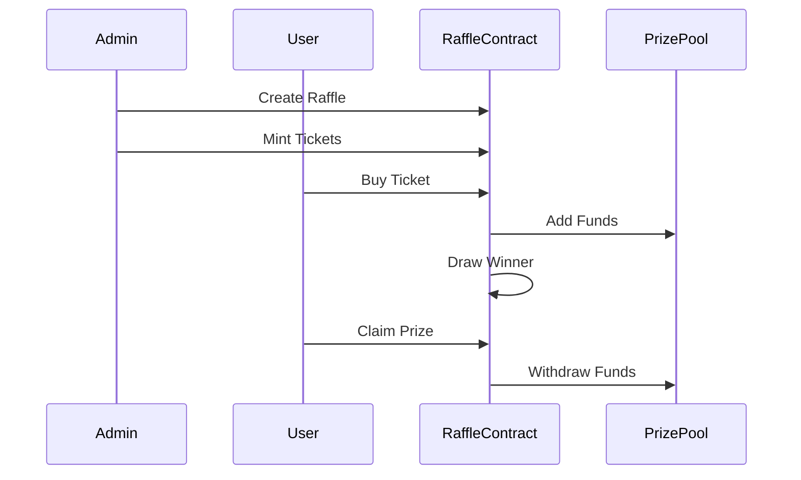
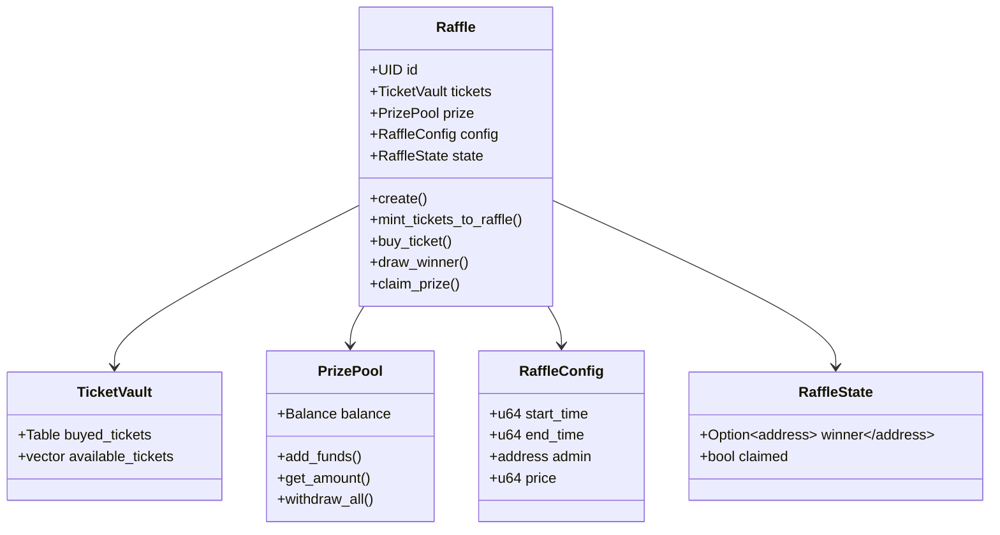

# aynrand-public-doc

# Aynrand

|  | **Interview Challenge**: Raffle System |
|--------------------------------------|--------------------------------------------------------------------------------------------------------------------------------------------------|

This is a Raffle architecture for Sui move language using good practices for modularity and separation of concerns, implementing a raffle system based on the lesson from the book of move https://move-book.com/ , and lessons from the paper 
"Building Random, Fair, and Verifiable Games on Blockchain"
https://arxiv.org/pdf/2310.12305

The idea is to implement a raffle system that is random, fair, and verifiable simulating issues and PR like the ones existing in the real world.

The name for Aynrand comes from the idea of randomness and fairness, and the fact that the system is not deterministic, but rather random, also the idea of implement a descentralized DRAND Number generator for a next iteration.

## System Architecture

### Sequence Diagram

- The **Admin** begins the raffle by setting it up and creating tickets for people to purchase.

- **Users** buy these tickets to enter the raffle, and their payments go into the **PrizePool**.

- Once the raffle is over, the system randomly selects a winner.

- The winner claims their prize, and the prize money is transferred to them from the **PrizePool**.

A more detailed diagram can be found in the [docs](docs/state_diagram.md)

### Class Diagram

A more detailed diagram can be found in the [docs](docs/state_diagram.md)

## Key Features

- **Lifecycle Management**: Raffles progress through distinct states (NotStarted → Active → Ended → WinnerDrawn)
- **Ticket Management**: Administrators can mint and manage ticket distribution
- **Prize Pool**: Secure handling of SUI tokens for a prize pool
- **Random Winner Selection**: Uses Sui's Random module for winner selection
- **Prize Claims**: A Winner can claim their prize after drawing

## Technical References

The system uses Sui Move's object model and implements best practices from:
- [The Move Book](https://move-book.com/)
- ["Building Random, Fair, and Verifiable Games on Blockchain"](https://arxiv.org/pdf/2310.12305)

# Lessons Learned
In this project, I faced many challenges like managing time, resources, learning from documentation, and understanding production projects. I had to decide whether to use Sui or Aptos, as both use the Move language but with differences. I found Sui to be a better and more robust solution based on the toolkit, code readability, and the TVL and ecosystem.

To learn the language, I started with the Move book and official documentation, then moved on to reading example code and projects like Kapy Adventure. I also watched videos about Move presentations at Certora.

Sui is a blockchain that comes from the fork of the Libra development teams by Meta, defining an architecture for Diem, their currency, based on Byzantine Fault Tolerance properties and a BLS scheme through validators for ID assignment and transactional object verification. This is very different from the classic non-scalable blockchain model, as it uses a directed acyclic graph model, allowing for greater scalability and becoming the most componentizable.

## Design Decisions, Modularity:

After understanding the language and the skill mechanisms for key, drop, store, and copy, and reviewing the differences between Rust and Move, I also understood the security mechanisms of capabilities, as well as visibility and shared objects.
I started thinking with a top-to-bottom approach, a modular architecture for greater development flexibility, understanding that the shared object model is the most suitable for creating these structures.

One important lesson learned in Move for Sui is that less is more, so the initial plan to create a reusable module for testing was discarded, and I moved to the test scenario of the Sui framework.

## Key Learnings

The assumption of similarity between Rust and Move challenged the initial plan to create a reusable module for testing, and I moved to the test scenario of the Sui framework.

It would have been better to implement a toy project first that takes 80% of the necessary features to quickly understand the language and its perks related to its skill system, which did not allow me to meet the entire development lifecycle, like testing, automated coverage and deployment, using github actions.
Coverage need it a custom sui cli compile and run, and this remains out of the scope of this project.

A change of scope from designing the solution based on Drand, which pivoted due to poor UX from generating a random number every 30 seconds, to designing a scheme based on Merkle trees for winner verification and random number generation based on BLS signatures, was discarded due to extra time in understanding the language and resolving errors.

One of the fundamental features of this language is returning objects that do not have drop, for example, and destroying them one by one. Another unique feature is the OTW, one-time witness, which simulates a single execution and refers to the concept of a constructor.
Regarding defined responsibilities, the raffle handles ticket creation and purchase, as well as prize claim and draw winner. I composed several structures for better understanding and versatility for the architecture.

This way is how we define a ticket vault, a prize pool, a raffle config, and a raffle state, and the ticket as a dependency of the raffle.

## Final thoughts:
Sui can be a great language for defining real-world assets and financial services, for defining transparency and identity schemes, and for finance. Additionally, consume-on-demand models can be derived, for storage beyond classic blockchain applications and thinking more about communications, due to its compatibility with SNARKs and zero-knowledge proofs, which enables new architectures and greater information compression and speed.

The challenge helped me learn about SUI and Move, improve my technical skills, and understand how to design scalable and secure solutions. Even though there were challenges, the lessons learned will be useful for future projects.
