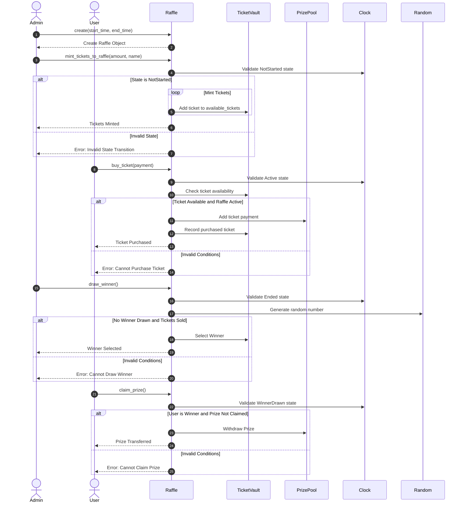

# Secuence Diagram, detailed

Explanation of the sequence diagram:

First, the **Admin** starts the raffle by calling the `create(start_time, end_time)` function, which triggers the event **RaffleCreated**. Then, the **Admin** mints tickets using the `mint_tickets_to_raffle(amount, name)` function. This function checks if the raffle is in the **"NotStarted"** state. If valid, it adds tickets to the **TicketVault** and triggers the **TicketsMinted** event. If the state is wrong, an **Error: Invalid State Transition** event is triggered.

Next, **Users** can buy tickets by calling the `buy_ticket(payment)` function when the raffle is active. The system checks ticket availability and the raffle's active status. If everything is okay, the payment is added to the **PrizePool**, the ticket is recorded, and the **TicketPurchased** event is triggered. If not, an **Error: Cannot Purchase Ticket** event is shown.

After the raffle ends, the **Admin** can draw a winner using the `draw_winner()` function. The system checks if the raffle has ended and uses a random number to pick a winner, triggering the **WinnerSelected** event. If something is wrong, an **Error: Cannot Draw Winner** event is shown.

Finally, the winner can claim their prize by calling the `claim_prize()` function if the raffle is in the **"WinnerDrawn"** state and the prize hasn't been claimed yet. The prize is then transferred from the **PrizePool**, and the **PrizeTransferred** event is triggered. If not, an **Error: Cannot Claim Prize** event is shown.

Come back to the README for the [Class Diagram](../README.md#class-diagram)